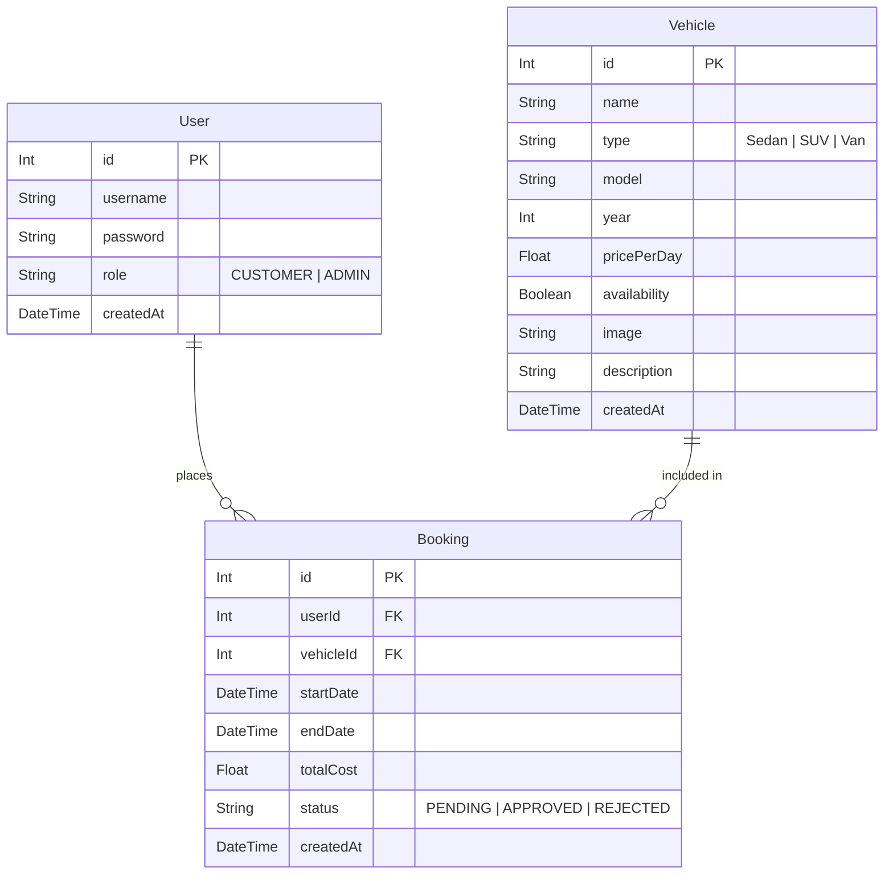

# Vehicle Rental System (AutoRent BD)

> **Course**: CSE 3206 Software Engineering Sessional Lab 2  
> **Process Model**: Prototype Model  
> **Time Limit**: Approximately 4 hours  
> **Team Size**: 3 Members  

---

## Project Overview

The **Vehicle Rental System** is a modular web-based Minimum Viable Product (MVP) built to simulate real-world vehicle reservations in Bangladesh. Designed for rapid evaluation under the **Prototype Model**, the platform enables customers to discover, compare, and reserve vehicles with dynamic daily cost calculation in Bangladeshi Taka (৳ BDT), while granting administrators full control over fleet inventory and booking requests.

---

## Problem Statement

Traditional car rental operations often rely on manual phone calls, paper ledgers, or fragmented messaging apps. This causes frequent scheduling conflicts, lack of transparent pricing, and difficulty tracking vehicle availability. Customers require an intuitive, instant way to view vehicle specifications, calculate costs based on flexible rental dates, and monitor booking status. Concurrently, rental operators need a centralized dashboard to track fleet metrics, adjust availability, and approve or reject reservations in real time.

---

## Objectives

1. **Working Application**: Deliver an end-to-end functional prototype within a 4-hour university lab timeframe.
2. **Core Rental Flow**: Provide a streamlined workflow: Login &rarr; Browse Fleet &rarr; Inspect Vehicle &rarr; Select Dates & Cost Calculation &rarr; Submit Booking &rarr; Track Status.
3. **Administrative Fleet Control**: Implement full CRUD (Create, Read, Update, Delete) management for vehicles and instant approval/rejection workflows for bookings.
4. **Transparent Localized Pricing**: Real-time daily rate calculation in Bangladeshi Taka (`total cost = rental days × price per day`).
5. **Demonstration-Ready Architecture**: Clean, responsive UI with zero external configuration headaches and one-click demo credentials.

---

## Features

### Customer Portal
- **Authentication**: Easy login with one-click demo autofill (`customer` / `customer123`).
- **Dashboard**: High-level overview displaying total bookings, pending requests, and approved trips.
- **Vehicle Catalog**: Searchable and filterable vehicle fleet (Sedan, SUV, Van) with availability toggles.
- **Vehicle Details**: High-resolution image, model, year, category, daily rental rate in ৳ BDT, and detailed vehicle overview.
- **Rental / Booking Flow**:
  - Interactive date pickers (Start Date & End Date).
  - Real-time rental duration calculation (`days`).
  - Dynamic total price breakdown (`rental days × price per day`).
  - Validation rules: Non-empty dates, end date &ge; start date, minimum 1 day duration, prevention of renting unavailable vehicles.
- **My Bookings**: Real-time tracking of personal bookings with status badges (`Pending`, `Approved`, `Rejected`).

### Administrator Portal
- **Admin Authentication**: Privileged login with one-click autofill (`admin` / `admin123`).
- **Admin Dashboard**: Real-time fleet and booking metrics:
  - Total Vehicles in inventory
  - Available Vehicles ready for rent
  - Total Bookings across all customers
  - Pending Bookings requiring review
- **Vehicle Management (CRUD)**:
  - **View**: Formatted inventory table with thumbnails and specifications.
  - **Create**: Add new vehicles with category, model, year, rate, and photo.
  - **Update**: Edit existing vehicle specifications and daily pricing.
  - **Delete**: Remove vehicles from the fleet.
  - **Availability Toggle**: 1-click button to flip vehicle between Available and Unavailable.
- **Booking Management**:
  - Filter bookings by status (`All`, `Pending`, `Approved`, `Rejected`).
  - 1-click **Approve** and **Reject** actions with instant status updates.

---

## Technology Stack

- **Framework**: [Next.js 16 (App Router)](https://nextjs.org/)
- **Language**: [TypeScript](https://www.typescriptlang.org/)
- **Styling**: [Tailwind CSS](https://tailwindcss.com/)
- **Database & ORM**: [Prisma ORM](https://www.prisma.io/) with [SQLite](https://www.sqlite.org/) (Embedded file: `prisma/dev.db`)
- **Icons**: [Lucide React](https://lucide.dev/)
- **Backend Architecture**: Next.js Server Actions and Route Handlers (integrated single-stack, no external server needed).

---

## Database Schema



---

## Project Structure

```
.
├── app/
│   ├── actions.ts                      # Server actions for Auth, Vehicle CRUD, & Bookings
│   ├── layout.tsx                      # Root layout with responsive Navbar and Footer
│   ├── page.tsx                        # Home landing page with hero and featured fleet
│   ├── globals.css                     # Global Tailwind CSS styling
│   ├── login/
│   │   └── page.tsx                    # Customer & Admin login with 1-click demo buttons
│   ├── dashboard/
│   │   └── page.tsx                    # Customer personal dashboard & fleet glance
│   ├── vehicles/
│   │   ├── page.tsx                    # Fleet catalog with category & availability filters
│   │   └── [id]/
│   │       ├── page.tsx                # Vehicle details and specifications
│   │       └── rent/
│   │           ├── page.tsx            # Rental confirmation page
│   │           └── RentalBookingForm.tsx # Live calculation & validation booking form
│   ├── bookings/
│   │   └── page.tsx                    # Customer "My Bookings" page
│   ├── admin/
│   │   ├── page.tsx                    # Admin Dashboard with system metrics
│   │   ├── vehicles/
│   │   │   └── page.tsx                # Admin Vehicle Management page
│   │   └── bookings/
│   │       └── page.tsx                # Admin Booking Management (Approve/Reject)
│   └── api/
│       ├── vehicles/                   # REST Route Handlers (GET, POST, PUT, DELETE)
│       └── bookings/                   # REST Route Handlers (GET, POST, PATCH)
├── components/
│   ├── Navbar.tsx                      # Header with role detection (Customer vs Admin)
│   ├── VehicleCard.tsx                 # Card component with image, badges, & pricing
│   ├── BookingStatusBadge.tsx          # Color-coded status badge (Pending, Approved, Rejected)
│   ├── AdminVehicleManager.tsx         # Interactive CRUD modal & management table
│   └── AdminBookingActionButtons.tsx   # Fast Approve/Reject action triggers
├── lib/
│   ├── prisma.ts                       # Prisma Client singleton
│   └── auth.ts                         # Cookie-based lightweight session management
├── prisma/
│   ├── schema.prisma                   # SQLite database models
│   ├── seed.ts                         # Database seeder with demo users, vehicles, & bookings
│   └── dev.db                          # SQLite database file
├── GIT_WORKFLOW.md                     # 3-member team Git collaboration guide
├── next.config.ts                      # Next.js configuration
├── package.json                        # Project dependencies and scripts
└── README.md                           # Comprehensive lab documentation
```

---

## Installation & Setup

### Prerequisites
- **Node.js**: v18.17+ or v20+ or v24+
- **npm**: v9+ or v10+ or v11+

### Steps

1. **Clone the repository**:
   ```bash
   git clone <repository-url>
   cd "SW Pr2"
   ```

2. **Install dependencies**:
   ```bash
   npm install
   ```

3. **Set up the SQLite Database**:
   ```bash
   npx prisma db push
   ```

4. **Seed sample data**:
   ```bash
   npx prisma db seed
   ```

---

## Running the Application

Start the local development server:

```bash
npm run dev
```

Open your browser and navigate to:
```
http://localhost:3000
```

To run a production build:
```bash
npm run build
npm run start
```

---

## Demo Credentials

For classroom evaluation and grading, one-click demo credentials are provided directly on the Login page (`/login`):

| Role | Username | Password | Default Redirect |
| :--- | :--- | :--- | :--- |
| **Customer** | `customer` | `customer123` | `/dashboard` |
| **Administrator** | `admin` | `admin123` | `/admin` |

---

## MVP Demonstration Walkthrough

### 1. Customer Workflow
1. Navigate to `/login` and click **Customer** (or enter `customer` / `customer123`).
2. Explore the customer **Dashboard** (`/dashboard`) showing booking statistics.
3. Click **Browse Vehicles** (`/vehicles`) and filter by vehicle type (e.g. *SUV*, *Sedan*, *Van*) or toggle *Available Only*.
4. Select a vehicle (e.g., **Toyota Corolla**) to view full specifications (`/vehicles/2`).
5. Click **Proceed to Rent** (`/vehicles/2/rent`).
6. Change the **Start Date** and **End Date**: observe the live calculation of **Rental Duration** and **Total Cost** in Bangladeshi Taka (৳).
7. Click **Confirm & Request Rental**: you will be directed to **My Bookings** (`/bookings`) with the new reservation in `Pending` state.

### 2. Admin Workflow
1. Click **Logout** from the Navbar.
2. Go to `/login` and click **Administrator** (`admin` / `admin123`).
3. View the **Admin Dashboard** (`/admin`) displaying:
   - Total Vehicles count
   - Available Vehicles count
   - Total Bookings count
   - Pending Bookings count
4. Navigate to **Manage Vehicles** (`/admin/vehicles`):
   - Click **Add New Vehicle** to add a new car to the fleet.
   - Click **Edit** to modify vehicle pricing or details.
   - Click the **Availability** button to instantly toggle between *Available* and *Unavailable*.
5. Navigate to **Manage Bookings** (`/admin/bookings`):
   - Review pending reservation requests.
   - Click **Approve** or **Reject** to immediately update the booking status.

---

## Software Process Model: Prototype Model

For this project, the **Prototype Model** was chosen as the designated software engineering process.

```
Initial Requirements Gathering
              ↓
  Quick Design & Architecture
              ↓
    Build Working Prototype (MVP)
              ↓
   User Evaluation & Feedback
              ↓
      Refine Requirements
              ↓
    Final Software Product
```

### Why the Prototype Model is Appropriate for this Project:
1. **Ambiguous and Evolving Requirements**: Vehicle rental workflows involve multiple interconnected business rules (e.g., daily rate calculations, minimum rental thresholds, availability locks, admin approval cycles). Developing a quick prototype makes these workflows tangible to stakeholders early.
2. **Immediate User Evaluation**: Lab evaluators and prospective customers can test the interface hands-on, providing direct feedback on usability, pricing transparency, and booking validations before time is spent on non-functional overhead.
3. **Mitigating Development Risk within 4 Hours**: Rather than spending precious hours writing rigid design specifications for features that may need revision, building a focused prototype allows immediate verification that the core rental loop functions reliably.
4. **Foundation for Iterative Refinement**: The modular architecture (App Router, Prisma schema, Server Actions) serves as an adaptable foundation that can easily incorporate payment gateways, telematics, and contract generation in subsequent development phases.

---

## MVP Scope & Limitations

### What is Included:
- Working customer and admin authentication.
- Complete vehicle catalog with filtering and search.
- Date-based duration and daily pricing calculation in ৳ BDT.
- Customer booking submission and reservation history.
- Admin metrics dashboard, full vehicle CRUD, and booking approval/rejection.

### What is Excluded (Future Improvements):
- Online payment gateways (bKash, Nagad, SSLCommerz, Stripe).
- Real-time GPS and vehicle telematics tracking.
- SMS and email notification triggers.
- Multi-branch pickup and drop-off logistics.
- Insurance policy selection and security deposit holds.
- Vehicle maintenance scheduling and servicing logs.

---

## Team Collaboration & Git Workflow

For detailed 3-member work division, Git branching, pull requests, and teacher evaluation guide, refer to:
- [`TEAM_CONTRIBUTION_GUIDE.md`](TEAM_CONTRIBUTION_GUIDE.md)
- [`GIT_WORKFLOW.md`](GIT_WORKFLOW.md)
